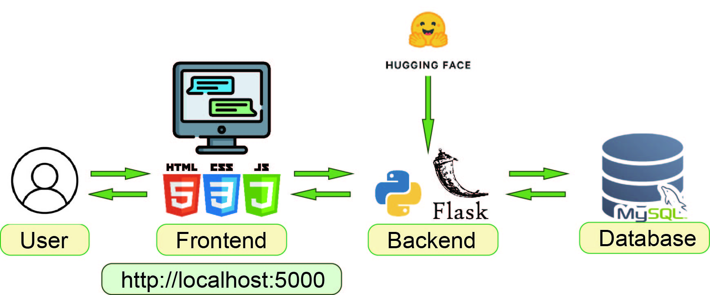
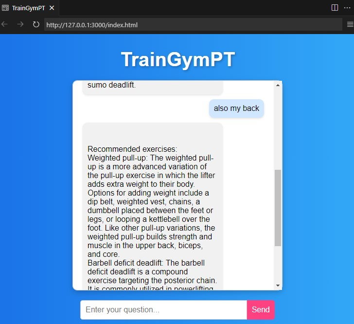

# TrainGymPT

TrainGymPT is a conversational AI fitness assistant application that provides exercise recommendations based on user queries. This app combines natural language processing (NLP) models for intent classification and dialogue generation, simulating an interactive fitness chatbot.



## Features

- **Zero-shot Classification**: Uses [joeddav/xlm-roberta-large-xnli](https://huggingface.co/joeddav/xlm-roberta-large-xnli) for intent detection.
- **Dialogue Generation**: Utilizes the [thu-coai/CDial-GPT2_LCCC-base](https://huggingface.co/thu-coai/CDial-GPT2_LCCC-base) model for generating dialogue responses.
- **Fitness Suggestions**: Provides workout recommendations based on the user’s target muscle group and fitness goals (e.g., muscle gain or fat loss).
- **Fitness Database Lookup**: Retrieves top-rated exercise suggestions from the fitness database to offer optimized workout plans for different muscle groups.

## Technologies Used

- **Flask**: Builds the API server and handles requests.
- **pymysql**: Connects to and queries the MySQL database.
- **transformers**: Used for NLP models, including intent classification and dialogue generation.
- **pandas**: Data processing library used for data management and formatting (only in specific data processing scenarios).
- Install required packages:
    
    ```bash
    pip install -r requirements.txt
    ```
    

## Dataset

The application utilizes a fitness dataset from [Gym Exercise Data](https://www.kaggle.com/datasets/niharika41298/gym-exercise-data), containing over 2,500 workout suggestions, including exercise names, descriptions, targeted muscle groups, required equipment, etc.

## Models

- **Intent Classification Model**: joeddav/xlm-roberta-large-xnli - an NLP model used for zero-shot classification.
- **Dialogue Generation Model**: [thu-coai/CDial-GPT2_LCCC-base](https://huggingface.co/thu-coai/CDial-GPT2_LCCC-base) - a model used to generate dialogue responses.

## Database Setup

### Creating the Database

- Open a new SQL tab in MySQL Workbench and enter the following SQL command to create the database:
    
    ```sql
    CREATE DATABASE gym_bot_db;
    ```
    
- Select the database:
    
    ```sql
    USE gym_bot_db;
    ```
    
- Create the exercise data table: Based on the Gym Exercise Dataset, create the `exercises` table to store exercise data with the following fields:
    
    ```sql
    CREATE TABLE exercises (
        ID INT PRIMARY KEY,
        Title VARCHAR(255),
        Description TEXT,
        Type VARCHAR(50),
        BodyPart VARCHAR(50),
        Equipment VARCHAR(50),
        Level VARCHAR(20),
        Rating DECIMAL(3, 1),
        RatingDesc VARCHAR(255)
    );
    ```
    
- Import data using Python: Use `importData.py` for data cleaning and importing.
    
    ```bash
    python importData.py
    ```
    
- Verify data import success:
    
    ```sql
    SELECT * FROM exercises;
    ```
    

## Configuration

- Update the database connection settings in `app.py` to connect to a local or remote database correctly. Start the Flask application:
    
    ```bash
    python app.py 
    ```
    
- Open a browser and navigate to [http://localhost:5000](http://localhost:5000/) to interact with TrainGymPT through the interface.

## User Interface




**💡Organized by ChatGPT 4.0**